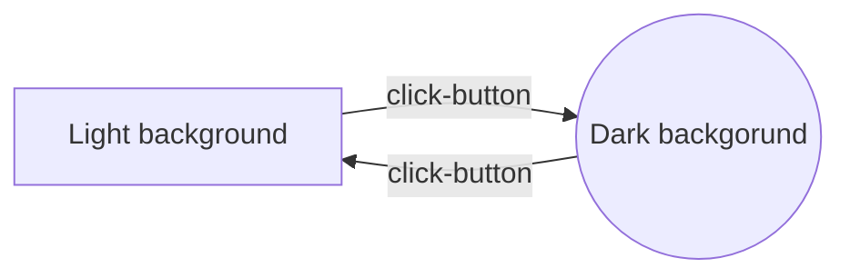

# Home page

I present you my first website created during the online course for Frontend Developer in YouCode school. 

## Features

The website describe my short story and some extras about me. 

## Tech

- HTML5
- CSS
- Java Script
- Markdown
- BEM convention
- camelCase
- Arrow function

## My first skills 

|HTML            	  	  |CSS                            |Java Script                  |
|-------------------------|-------------------------------|-----------------------------|
|links (navigation & url) |responsivity      		      |arrow function   			|
|lists (ol & ul)	      |styling font		              |background color change 		|
|articles and sections    |styling list and links		  |variable declarations 		|
|classes				  |styling tabel and containers   |method - addEventListener	|

## First function diagram

